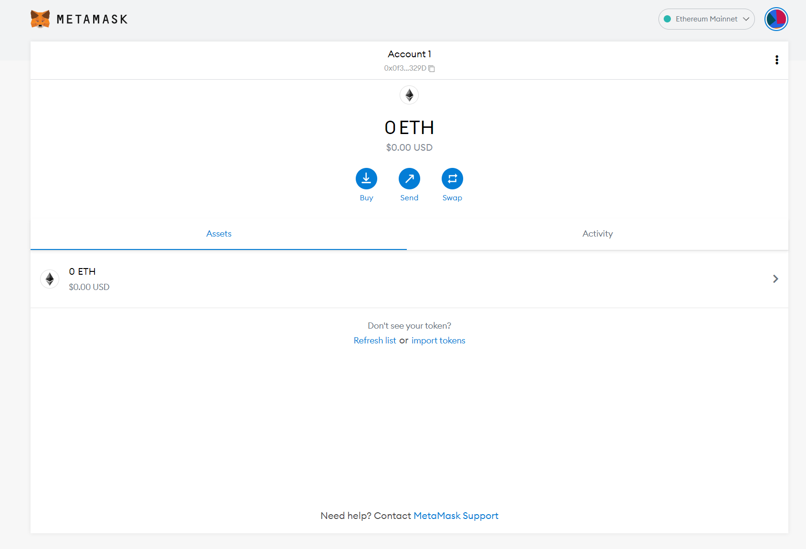
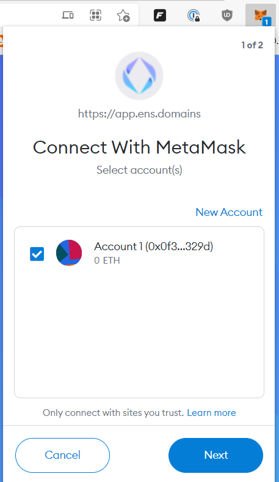
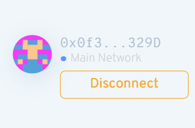
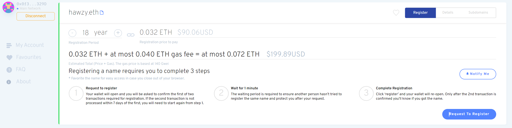

For day 13 of 100 Days of Code, I'm going to buy a .eth Top Level Domain (TLD), Hawzy.eth.  I'm going to walk through doing the needful, from setting up a metamask wallet to purchase - lets go!

## Setup MetaMask Wallet

Head over to https://metamask.io/download/ and install the plugin of the browser of your choice.  

Once the browser extension is installed follow the prompts to **Create a Wallet** and pick a secure unique password.  Store your recovery key (master key) somewhere safe, a password manager or onedrive secure vault are good options - don't ever share this with anyone!

So now we have an address we can transfer funds into, next step is to buy some Ethereum and transfer to this wallet.

## Load Ethereum into Wallet

Couple ways you can do this, if you already bought some Ethereum through an exchange like coinbase or kraken, you can login and transfer directly to the metamask Ethereum adress.

You can also buy directly through a 3rd party service connected to metamask by pressing **Buy** in the wallet.   I did this process through a company called sendwyre, had to jump through a couple hoops, like logging into my credit card account and getting a code from a pending transaction to prove I'm me + SMS authentication code.  Total transaction time took less than 5 minutes for the Ethereum to show up in my wallet.

## Connect Wallet to Ethereum Name Service

Point your browser with metamask extension to https://app.ens.domains/.  Once there your extension should automatically prompt you to connect, you can also click the extension icon.

Press **Next** and **Connect**.

## Register Domain name with Ethereum Name Service (ENS)

Search for the domain name you want, and make sure your wallet is connected on the left hand side.

5 letter domains run  \$5/year, I want mine to expire in 2040, so that'll be $80 + whatever gas fees end up being

Press Proceed to register, gas fees fluctuate in the metamask wallet, for mine they ended up being \$11-\$12. and then there is a second transaction gas fee that ended up being another \$60. Decentralized finance!  Total cost with gas + fees for me ended up being almost exactly \$10/year for a total cost of \$181.47 -or- 0.0649611 ETH.  Which ends up being about the same as a .net TLD domain name.

So now if i want to update any records on hawzy.eth that is going to be another gas transaction fee to put it on the blockchain.  I'm going to wait a little bit to figure all I want to put in there (maybe grab an NFT first for an avatar, if I find one that I like) and then register all that info at once: twitter, avatar, website, other crypto wallets etc.  That will be in a future blogpost.

## Conclusion

Today I setup a metamask wallet, added some crypto and purchased a TLD, what exactly am I going to do with it? No idea.. yet.